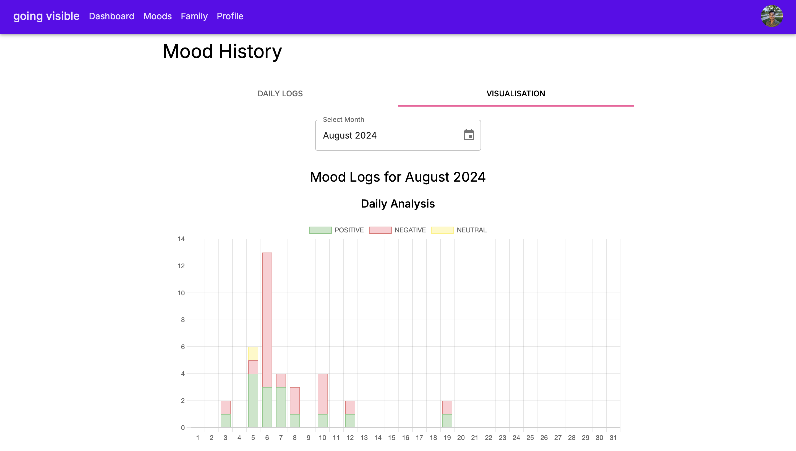
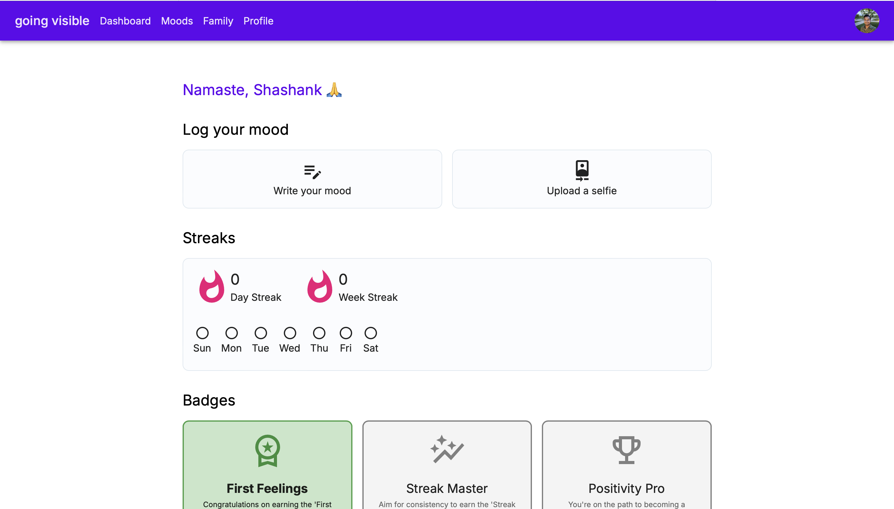

# Going Visible

**Going Visible** is a mood-tracking web app designed to help individuals with invisible illnesses like anxiety, depression, and chronic pain. The app analyzes mood sentiment through selfie uploads or text-based mood logs using the Google Gemini API, creating interactive visualizations to track emotional patterns over time. It offers personalized insights and alerts to enhance emotional well-being and connectivity.

## 🔗 Links

- **🏆 Competition Submission**: [Google AI Challenge - Going Visible](https://ai.google.dev/competition/projects/going-visible)
- **🎥 Demo Video**: [YouTube Demo](https://www.youtube.com/watch?v=FRc86neAe0M)
- **📖 Project Details**: [Project Description](https://www.shashankrajak.in/projects/going-visible-webapp)
- **📝 Blog Post**: [More about the Going Visible Project](http://localhost:3000/blogs/going-visible-google-gemini-api-developer-competition-submission)

## 📸 Screenshots





## Getting Started

### Prerequisites

Ensure you have [Node.js](https://nodejs.org/) installed on your machine.

### Installation

1. **Clone the repository:**

   ```bash
   git clone https://github.com/yourusername/going-visible.git
   cd going-visible
   ```

2. **Install npm modules with legacy peer dependencies:**

   ```
   npm install --legacy-peer-deps
   ```

3. **Update environment variables:**

   Rename .env.example to .env and update the necessary variables.

4. **Run the development server:**

   ```
   npm run dev
   ```

Open http://localhost:3000 with your browser to see the app in action.

### Development

You can start editing the app by modifying app/page.js. The page auto-updates as you edit the file.

### Project Features

1. **Mood Tracking**: Log and track your moods through selfie uploads or text entries to gain insights into emotional patterns.
2. **AI-Powered Sentiment Analysis**: The app leverages the Google Gemini API to analyze mood sentiment from both facial expressions in selfies and text-based mood logs.
3. **Interactive Visualizations**: Create comprehensive mood visualizations and charts to track emotional patterns and trends over time.
4. **Personalized Insights**: Receive AI-generated suggestions and insights based on your mood data analysis.
5. **Support Network Alerts**: Notify family and friends when extra support is needed.

## 🎯 Purpose

Going Visible aims to bridge the gap between those experiencing invisible illnesses and their support networks, making mental health management more accessible and connected.

### Contact

For any questions, feedback, or if you're interested in collaborating, please contact me at shashanksrajak@gmail.com
